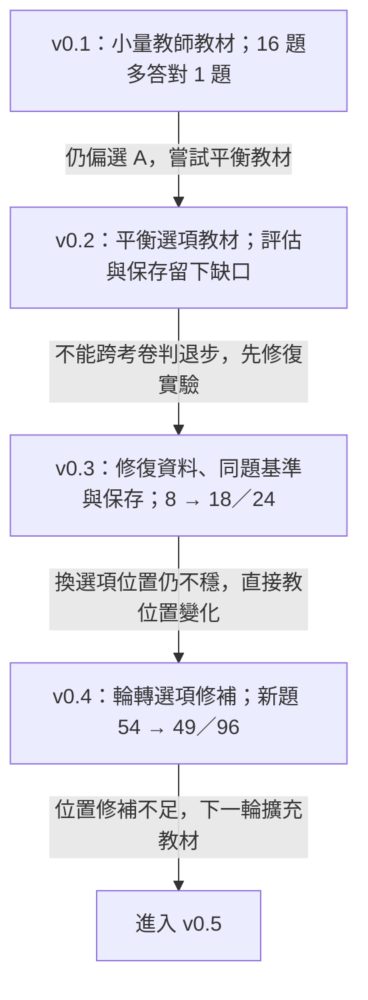
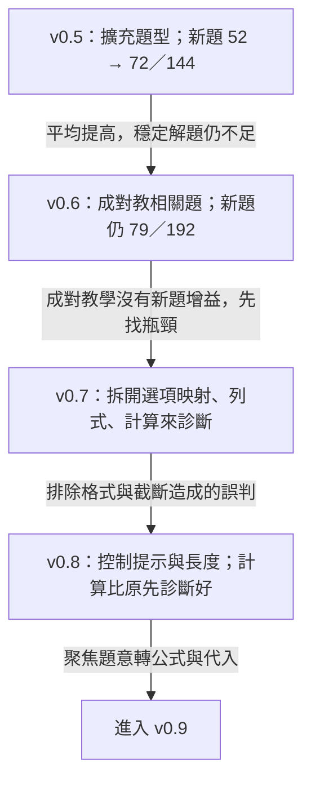
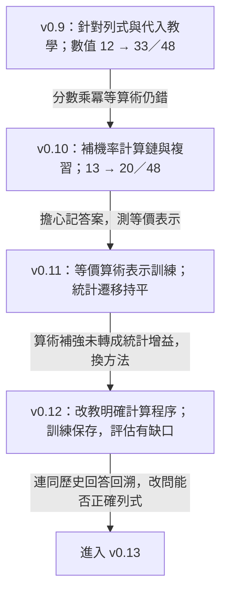
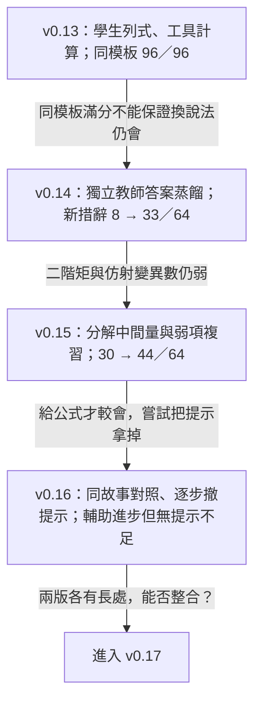
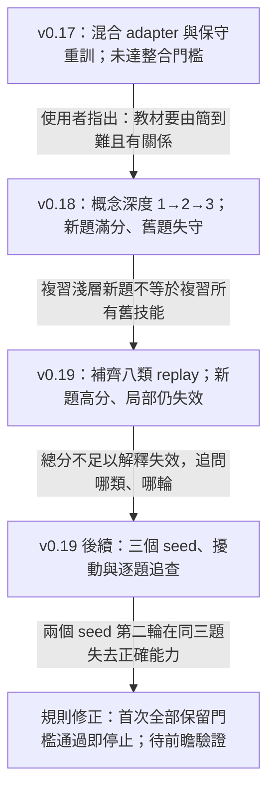
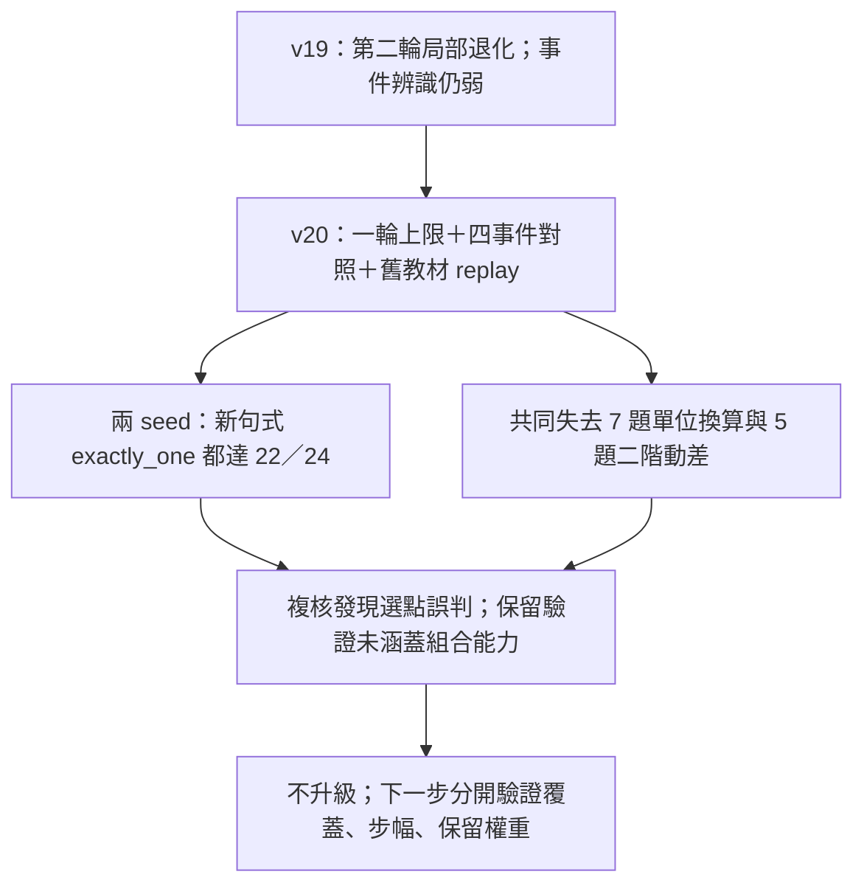

# 蒸餾實驗 v0.1–v0.20 與 Kaggle V55–V58：問題、方法、結果與撤回

這份文件整理 3Beethoven **統計蒸餾支線**的 v0.1–v0.20 研究節點，並補上後來的 Kaggle V55–V58，保留我們為什麼繼續、改了什麼，以及結果如何改變下一個問題。模型／研究版本號不是 Kaggle 保存版本號；v0.7、v0.8 是診斷實驗，並未訓練新權重。

**閱讀原則：**這是事後依原始報告、協議與使用者回顧整理的研究路徑。「預期」是對當時方法所欲解決問題的重述，不一律代表當時已事前註冊。流程箭頭表示研究動機的延續，**不表示每版權重都承接上一版**。各輪題目、提示與判分曾改變，下面的分數只在同一列所指的同場比較內解讀，不能串成跨版本準確率曲線。V58 原先的成功／採用解讀已撤回；保留原分數不是保留原結論。

## 1．v0.1–v0.4：先確認教得動，再確認分數可信

| 版本 | 遇到的狀況與預期 | 使用的方法 | 得到的結果與判斷 |
|---|---|---|---|
| **v0.1** | 70B 老師在選定的小型統計題集明顯優於 3B，想測試少量教師答案能否移轉能力。 | 120 筆教師教材，111／9 訓練與驗證，QLoRA 訓練 3 輪。 | 同一 16 題由 9/16 到 10/16；仍有選 A 偏差。這是小樣本的初步改善，不能證明穩定能力提升。[原始紀錄](../results/2026-09-02_stats_distillation_v0_1.md) |
| **v0.2** | 第一輪改善有限且有選項偏差；嘗試平衡選擇題教材。 | 採用平衡教材生成與訓練流程，改以 24 題開發集評估。 | 歷史報告分數 41.67%（10/24），但沒有同題原生 3B 基準，訓練／測試輸出格式也不同；後續未能驗證當時權重保存。**不能把 62.5% → 41.67% 寫成退步。**完整動機與成果保存紀錄有缺口。[後續核查](STATS_V0_3_PROTOCOL.md) |
| **v0.3** | v0.2 混有資料、格式、比較與保存問題，需先建立能核查的實驗。 | 60 題可計算參考答案，逐題審教師解說；48／12 分割；同場測原生學生、訓練學生與教師，補做新題及選項輪轉。 | 已曝光的 24 題，字母作答由 8/24 到 18/24。另組 60 題原序 35% → 58.3%，但四種排列全對只有 17/60。有效果的跡象與位置敏感同時存在。[結果](STATS_V0_3_RESULTS.md)、[新題](STATS_HOLDOUT_V1_RESULTS.md)、[輪轉](STATS_ROTATION_V1_RESULTS.md) |
| **v0.4** | v0.3 換選項位置會變，預期位置平衡訓練能改善穩定性。 | 重用同批教師教材與分割，加入選項輪轉修補。 | 同場新題 v0.3 54/96、v0.4 49/96；舊題 129/240 → 134/240。位置一致有些改善，卻未帶來新題總分提升；不取代 v0.3。[結果](STATS_V0_4_RESULTS.md) |

## 2．v0.5–v0.8：更多教材仍不夠，拆開看錯在哪裡

| 版本 | 遇到的狀況與預期 | 使用的方法 | 得到的結果與判斷 |
|---|---|---|---|
| **v0.5** | 只修選項位置不足；預期更廣的例題與情境有助遷移。 | 擴為 180 訓練題、24 驗證題；教師教材經獨立計算與內容稽核。 | 新題 v0.3 52/144 → v0.5 72/144，但四種排列全對僅 2/36。訓練跑三輪，驗證選第一輪；後兩輪驗證 loss 上升，早期已有過擬合跡象。保留為研究候選。[結果](STATS_V0_5_RESULTS.md) |
| **v0.6** | 題目彼此的關係可能沒教清楚，嘗試成對呈現相關問題。 | 原先抽象教學卡有錯而棄用；改將已稽核 v0.5 題目／解說配對。 | 同場新題 v0.5 與 v0.6 都是 79/192；舊題 133/240 → 140/240。未達預設成功門檻，保留 v0.5。配對同時改變文字量與重複曝光，不能當作只改「關係」的單因素實驗。[結果](STATS_V0_6_RESULTS.md) |
| **v0.7** | 分數不再改善，需分辨是看不懂題、算不出來，還是選不對選項。 | **只做診斷**：提供正確數值、公式、代入算式，並移除選項分別測試。 | v0.5 原 MC 為 41/96，提供正確數值後選項映射達 96/96；獨立求值差。證據指向多重瓶頸，但部分結果受提示、格式及輸出長度影響，須由下一輪校正。[結果](STATS_DIAGNOSTIC_V0_7_RESULTS.md) |
| **v0.8** | v0.7 的低分可能把輸出限制誤認成能力缺失。 | **只做診斷**：增加輸出空間，使用簡潔計算提示，另外複核格式。 | 給定算式時 v0.5 自動 18/24、格式複核 20/24；完整題目用簡潔提示仍只有 8/24。不能說小模型普遍不會計算；題意轉換與代入仍需加強。[結果](STATS_DIAGNOSTIC_V0_8_RESULTS.md) |

## 3．v0.9–v0.12：教計算之後，發現「列得對、算錯」

| 版本 | 遇到的狀況與預期 | 使用的方法 | 得到的結果與判斷 |
|---|---|---|---|
| **v0.9** | 診斷顯示題意轉公式、代入與計算鏈都需教。 | 從原生學生訓練，180 訓練／24 驗證，使用經稽核的簡潔教師解答。 | 同場新 MC：v0.5 91/192 → v0.9 123/192；複核數值 12/48 → 33/48。超過原生學生兩倍，但輪轉穩定性未達門檻；舊 MC 133/240 → 127/240。回溯列式與代入分為 45/48，顯示最終數值分漏掉部分能力。[結果](STATS_V0_9_RESULTS.md)、[回溯](STATS_FORMULATION_AUDIT.md) |
| **v0.10** | 機率分數運算仍錯，預期完整計算鏈加複習有助改善。 | 112 筆稽核教師紀錄，組成含複習的 516 訓練序列、64 驗證序列。 | 同場 v0.9 → v0.10：數值 13/48 → 20/48，MC 67/192 → 87/192；仍未達主要目標。回溯代入列式 42/48 → 45/48，算術與列式應分開看。[結果](STATS_V0_10_REPORT.md)、[回溯](STATS_FORMULATION_AUDIT.md) |
| **v0.11** | 使用者質疑熟悉小數可能只是記憶；預期等價表示練習能使算術更穩定。 | 400 筆程序化精確算術加 516 筆原教材複習；無新增教師呼叫，驗證選第一輪。 | 同場標準表示 43/60 → 39/60，等價表示 23/60 → 31/60；統計遷移 16/48 → 16/48。局部算術變好，沒有證明統計能力跟著改善。[結果](STATS_V0_11_REPORT.md) |
| **v0.12** | v0.11 的算術補強沒有帶來遷移，改試更明確的程序教學。 | 從 v0.10 重起；560 筆位值乘法、乘冪、GCD、約分及統計計算鏈，加 516 筆複習。 | 270 次更新完成，驗證選第 135 步，Kaggle 已保存；完整比較在瀏覽器存取中斷時尚未完成。**目前保留紀錄不足以判定 v0.12 提升或失敗。**後續改列式目標也依據 v0.9–v0.11 的原始回答，而非虛構 v0.12 結果。[保存紀錄](STATS_V0_12_INTERIM.md) |

## 4．v0.13–v0.16：把計算交給工具，再追查概念弱項

| 版本 | 遇到的狀況與預期 | 使用的方法 | 得到的結果與判斷 |
|---|---|---|---|
| **v0.13** | 歷史答案常有正確公式與代入，卻在算術失敗；改讓學生負責可執行列式。 | 從 v0.10 出發，384 訓練／64 驗證／96 測試；程序化 SFT，輸出數值綁定與算式，再由工具計算。 | 同模板族 96/96 列式成立；回溯原生與 v0.10 正確列式出現數為 18/96、39/96，部分伴隨矛盾。這些回溯分不等於合格工具介面分。後續換措辭測試暴露遷移弱點，滿分不能當未知概念泛化。[協議](STATS_V0_13_PROTOCOL.md)、[回答](STATS_V0_13_RESULTS.json)、[格式獨立複核](STATS_V0_13_FORMAT_INDEPENDENT_REVIEW.json) |
| **v0.14** | 程序模板學得好，不保證自然語言遷移；也需確認教師答案本身可靠。 | 接 v0.13，以 126 筆訓練／31 筆驗證的獨立且逐題驗證教師答案做回應蒸餾；改一行數值算式。 | 同場新措辭／參數 64 題：原生 8、v0.13 8、v0.14 33；舊 MC v0.13 128/240 → v0.14 123/240。老師也有錯，須驗證；學生有進展但並非全面保留。[結果](STATS_V0_14_TRAINING_RUN.md) |
| **v0.15** | 二階矩、仿射 Poisson 變異數等弱；預期教平均數、變異數等中間量可幫助組合。 | 接 v0.14，200 訓練／30 驗證；教師答案稽核、弱項加量、中間量分解與舊題複習，75 次更新。 | 同場 v0.14 30/64 → v0.15 44/64，**14 題錯轉對、0 題對轉錯**；但兩個目標弱項仍各 0/8。另做診斷，給通用公式可到 7/8 與 4/8。整體改善與目標未解同時成立。[完成紀錄](../README.md)、[診斷](STATS_V0_15_DIAGNOSTIC.md) |
| **v0.16** | v0.15 在提示下較會，預期同故事對照與撤提示能轉成自主列式。 | 48 個故事對照倍率、平均數、變異數、二階矩；完整公式 → 所求量提醒 → 無提示，混入複習，150 次更新。 | 同場無提示 v0.15 34/96 → v0.16 29/96；兩弱項有公式時 11/24 → 22/24。目標部分改善，但其他題型受損，未成通用替代版。**這是提示程度分階段，還不是概念深度 1→2→3。**[結果](STATS_V0_16_REPORT.md) |

## 5．v0.17–v0.19：整合、排序與保留，最後追到「多練一輪反而壞」

| 版本 | 遇到的狀況與預期 | 使用的方法 | 得到的結果與判斷 |
|---|---|---|---|
| **v0.17** | v0.15 與 v0.16 各有強弱，使用者提出重新訓練或「縫合」。 | 三種 adapter 更新混合比例；另從 v0.15 以較低學習率、256 筆歷史教師教材做均衡複習，驗證先選候選。 | 同場 v0.15 64/96、v0.16 57/96、最佳混合 65/96、重訓 64/96。混合多對 5 題也失去 4 題，沒有達成整合目標。這裡明確允許 `comb(n,r)`，不可和上一輪的絕對分數直接比較。[結果](STATS_V0_17_REPORT.md) |
| **v0.18** | 使用者看過 15、16、17 後提出：先一次概念轉換，再混入兩次、三次，保留早期題與 checkpoint。 | 把概念深度落實為分階段課程、複習與進階條件，設相同教材曝光量與更新量的打亂順序對照。新增答案為程序生成。 | 新組合 v0.15 76/96，分階段與打亂均 96/96；舊題 v0.15 64/96，兩組降為 36/96、44/96。**未證明排序優於打亂**；兩者都沒保住舊技能。原 replay 只涵蓋新課程淺層，未涵蓋歷史八類。[動機](STATS_MOTIVATION_EXPECTATIONS.md)、[結果複核](STATS_V0_18_TRANSFER_REVIEW.md) |
| **v0.19** | v0.18 新課程高分卻失去歷史技能；預期全面舊題複習及逐類保留門檻能改善。 | 從固定原 v0.15 出發，192 筆歷史教師複習＋288 筆程序化新題，共 480；逐輪驗證、逐題型保留門檻及 checkpoint 回退，無新增教師呼叫。 | 原 seed 1919 跑一輪／60 次更新：新題 72/96 → 96/96，舊題 59/96 → 56/96，exactly_one 10/12 → 1/12。未通過保留門檻，不升級。整體配對 p=0.7011，未偵測到總分差異；局部事件題失效須另看，不能用總分掩蓋。[結果](STATS_V0_19_REPORT.md)、[分析](STATS_V19_ANALYSIS_REPORT.md) |

## 6．v0.19 的後續追查：把失望變成可檢驗的規則修正

本節只描述 v0.19 當時的複驗與分析；後來完成的 v0.20 另見第 7 節。

| 追問 | 做了什麼 | 確認到什麼 |
|---|---|---|
| 96/96 是不是只會模板？ | 固定權重測原敘述、改寫、數字量級，並在三個 seed 重做。 | 三個 v0.19 原敘述與量級題均 24/24，改寫僅 15、15、14/24。高分可重現，但語言遷移不穩；不能僅憑滿分證明記憶，也不能把它叫未知概念泛化。 |
| 差幾題會不會只是 seed 波動？ | v0.15、v0.19 各跑 1919、2027、31415，完成六次訓練及 3,120 筆共同評估。 | v0.15 舊題為 52、55、49/96；v0.19 為 56、56、48/96。三個新 v0.15 不是三個 v0.19 的父模型；v0.19 均從原固定 v0.15 出發。不能把組均值差當單一因素效果。 |
| exactly_one 三次是否同一種壞法？ | 逐題分類：漏事件分支、兩者都漏、把恰好一個寫成兩者相同，以及數字綁定錯誤。 | 固定父模型 10/12，三個 seed 為 1、7、4/12；共同事件弱點存在，但錯誤分布不同。另一組事件對照三次都失敗，原 v0.15 也已失敗，不能全歸因 v0.19。 |
| 第一輪通過，第二輪為什麼不過？ | 對照 seed 2027、31415 的兩輪原始答案、逐類驗證、教材與 loss。 | **兩個 seed 都在同三題仿射 Poisson 變異數由對變錯**；該驗證類別從 3/6 到 0/6。第二輪總分仍過總量門檻，但此類低於 1/6，因此被退回第一輪。 |
| 越練 loss 越低，能力卻下降？ | 比較相同紀錄方式的兩輪訓練 loss 與答案。 | 兩次訓練 loss 約 0.092 → 0.012；資料比例及學習率不變，部分保留能力卻消失。降低訓練 loss 不足以當繼續訓練的理由。尚無逐 batch／逐類 loss，不能鎖定是哪個梯度造成。 |

來源：[多 seed 最終報告與逐題分析](STATS_SEED_REPLICATION_REPORT.md)、[exactly_one 對照資料](STATS_SEED_EXACTLY_ONE_COMPARISON.json)、[兩輪對照資料](STATS_SEED_EPOCH_TRANSITION.json)。

### 最能讓人看懂的錯誤對照

下面是同一批三題的**第一輪正確式與第二輪實際回答**，不是示意數字。

| 第一輪：兩個 seed 都正確 | 第二輪：seed 2027 | 第二輪：seed 31415 |
|---|---|---|
| `7² × 62` | `7² × 62 ÷ 7` | `7² + 2` |
| `7² × 17` | `7² × 17 + 7 × 19 − 7² × 17` | `7² × 17 + 19` |
| `3² × 44` | `3² × 44 ÷ 3 + 3` | `3 + 3 × 44` |

題目要的是變異數。第一輪能保留倍率平方與 Poisson 參數的關係，第二輪卻多除倍率、混入平移量，或改用類似平均數的式子。**同三題失效是直接證據；每個 seed 的錯誤算式並不完全相同。**

這支持「此配方在第二輪出現局部保留失效」，但還不能證明失去的是「最晚學會的能力」，也不能用第二輪的 Poisson 變異數失效解釋第一輪已存在的 exactly_one 差異。

### v0.19 結束時提出的規則（歷史狀態）

**下一次將「首次所有題型均通過預定保留門檻，即停止並保存」列為待驗證的停止規則，不再單純等兩輪停滯或四輪上限。**保留門檻通過不代表每題全對，也不自動代表模型可以升級；升級仍需獨立測試新能力、改寫遷移及舊能力保留。

同時固定一組永久基準、題目與 prompt／判分規則；各輪專項測試另報。歷史上已有 60 題四種排列的 MC 紀錄，但須核對載入及生成條件才能接成同一條線，240 次回答也不是 240 個獨立題目。三個 seed 提供初步變異估計，還不足以宣稱精確掌握所有波動。

這次能交出的研究產出是：**平均分數 → 局部錯誤 → 跨 seed 複驗 → 定位到第二輪 → 修正停止規則**。蒸餾在部分任務有增益，單一學生同時保有新舊能力仍未達標；目前保留原 v0.15，不升級 v0.19。規則已留下，效果須由未來實驗驗證。[Review 與交接](STATS_REVIEW_HANDOFF.md)

## 7．v0.20：事件教得會，但一輪內也會失去其他能力

更新：2026-09-07，America/Los_Angeles。本節為完成結果；第 8 節為待討論提案，尚未訓練。

| 版本 | 遇到的狀況與事前預期 | 使用的方法 | 完成結果 |
|---|---|---|---|
| **v0.20** | v19 出現後段退化，原 v15 在事件改寫仍弱；預期對照事件集合能轉移到新句式，一輪上限可避開已知第二輪風險。 | 執行提案「1＋3」：192 筆四事件對照教材＋192 筆八類舊教師 replay；兩個 seed 從同一原 v15 重起，各最多 48 updates，保存 24／48 步。沒有加入提案「2」的 Adding 句式，也未測完整 1→2→3 深度課程。 | exactly_one 新句式由 0/24 到兩次皆 22/24；其他能力未保住，兩個候選均不升級。新教師呼叫 0。[完成報告](STATS_V0_20_REPORT.md) |

| 複核後同場測試 | 原 v15 | v20 seed 2027，48 步 | v20 seed 31415，24 步 |
|---|---:|---:|---:|
| 新句式 exactly_one／24 | 0 | 22 | 22 |
| 四事件合計／96 | 40 | 94 | 83 |
| 舊列式／96 | 59 | 57 | 54 |
| 既有組合題／96 | 72 | 53 | 61 |
| 二階動差／24（組合題子集） | 10 | 0 | 5 |
| 永久 MC／240 | 126 | 128 | 128 |

共同的具體錯誤：`48*(210/60)` 變成 `48*210`；`66**2+123` 變成 `66**2`。兩個 seed 共同失去 12 題，包含同樣 7 題漏掉 `/60`，以及 5 題遺失二階動差的變異數項。這是可重現的干擾方向，不等於已證明 3B 容量不足。兩個候選的步數不同，也不能把差異全歸因 seed。

**停止規則須精確描述：**v20 實際上先完成一輪訓練，再驗證半輪與一輪 checkpoint；不是線上首次過關即停的直接驗證。它避開第二輪，卻仍出現一輪內的保留損失，不能據此宣稱早停已解決遺忘。

**評分與保留的缺口：**66 筆待複核紀錄已全部定案。基準舊驗證 interval 的等價式加回一分後，31415 半輪的 4/6 低於正確門檻 5/6；原自動選點曾誤放行。原驗證也沒有直接保護既有組合題的每一類。2027 舊 poisson_time 7→4/12；31415 舊 interval 9→3/12、uniform_time 8→5/12，均違反逐類保留要求。保留原 v15，不用事件總分掩蓋失效。

來源：[複核後摘要](STATS_V0_20_RESULTS_SUMMARY.json)、[逐題複核](STATS_V0_20_SEMANTIC_REVIEW.json)、[原始配對與錯題](STATS_V0_20_REVIEW_BUNDLE.json)。四份 adapter 與報告已保存於 [Kaggle Version 48 ZIP](https://www.kaggle.com/code/trinashih/3beethoven-v0-2/output?scriptVersionId=347911004&select=3beethoven_stats_v0_20.zip)，370,479,673 bytes；[權重與 ZIP 雜湊](STATS_V0_20_BACKUP_RECEIPT.json)。GPU 已停止。

## 8．三個候選版本：先討論，不代表已排定三次訓練

**歷史草案註記（2026-09-07）：**以下三案保留當時的動機與預期，均未執行。全案 review 後，優先方向已修正為第 9 節的「完整教材、兩個起點對照」；下文的 A 優先及數量／更新上限不代表現行已凍結 protocol。

核心問題由「能不能教會 exactly_one」改成「如何教會它，同時保住單位換算、動差及其他事件」。以下暫稱 A／B／C，正式版本號待決；三者都從原 v15 開始，不串接前一候選權重。

### 所有候選先共用的修正

- 選點前完成等價式複核；維持原始回答、可執行性與數學判定的分離，不能補寫缺項或偷改答案。
- 保留驗證同時涵蓋歷史八類、四類組合題及四事件；moment 原已 0 分的舊驗證不能充當二階動差已受保護的證據。
- 事前凍結逐類門檻、原本較弱類別的最低目標及選點規則；每 12 updates 驗證／保存，最多 48 updates。首次同時達到新能力與保留目標便停止；沒有合格點就不升級，不加跑到過關。
- 先用獨立開發資料修好評分與驗證流程，再凍結教材／新測試。v20 已看過的題只作回歸測試；不得把其數值和答案回填教材。新測試應包含多種未教句式與不同數字表示，所有候選共用，同一故事與參數變體不得跨分割。
- 每候選至少相同兩個 seed；相同有效 batch、checkpoint 時點、最大更新預算。到同一步的驗證用來比較訓練軌跡，提早停止造成的曝光差異另外列出。獨立測試只評估按驗證選出的權重，不拿測試挑點。

| 候選 | 唯一相對比較基準 | 要檢驗的假設 | 具體草案 | 預期與風險 |
|---|---|---|---|---|
| **A：補齊 replay 的概念與說法覆蓋** | 相對 v20 改 replay 的配置；共用修正另外註明 | 舊教材雖有 family 名稱，實際上沒有足夠保護現在測到的概念／說法 | 保留 192 筆事件對照；192 筆 replay 改由歷史八類＋四類組合題共 12 個任務格取樣，暫擬各 16 筆；使用既有合法訓練分割，補齊秒／分鐘、均值平方／二階動差及相關說法。LR 2e-5 | 最貼近已知缺口；但重新分配會壓縮原八類曝光，不能保證不產生其他損失。這是覆蓋配置試驗，不是只改排序的單因素實驗。 |
| **B：同教材，減小學習率** | 只相對 A 將 LR 2e-5 改為 1e-5 | 教材已覆蓋，問題仍可能是更新步幅太大 | A 的題目、順序、loss 權重、batch、最多 48 步完全相同；不為了追上訓練 loss 補跑第二輪 | 若同樣新能力下保留較好，支持減小步幅；若新舊都接近原 v15，可能只是學得少，不能叫成功。 |
| **C：同教材，提高保留題的 loss 權重** | 只相對 A 改新題與 replay 的相對 loss 權重 | 保留例題已出現，但對更新方向的影響仍不足 | A 的資料、順序與 LR 2e-5 不變；以每筆回答 token 平均的 loss 計算，A 為 `(L新+L舊)/2`，C 為 `(L新+2L舊)/3`；不增加重複題數 | 若保留改善且事件仍過關，支持提高保留壓力；可能犧牲新概念學習，舊教材也可能被過擬合。需核對 masking 與 loss 正規化，工程成本高於 B。 |

A 是我優先建議的下一個候選；B、C 是分開解釋失效原因的對照，不預設三者一起改，也不預設三者都必須跑。A 若已穩定達標即可結束；若事件改善但保留仍失守，再判斷 B 或 C 是否值得投入。三者全部執行至少六次 seed 訓練，主要時間成本仍會在驗證與測試，不應因單次訓練只需數分鐘就稱為幾乎免費。

replay 與最佳化約束是持續學習研究中的不同處理方向，但文獻結果不保證適用於本輪 3B／QLoRA。上述數量、1e-5 與 2 倍權重是待檢驗的工程假設，不是已知最佳值。參考：[Continual Learning and Catastrophic Forgetting](https://arxiv.org/html/2403.05175v1)。本輪不加入 logit KD，也不以 adapter 混合宣稱完成單一學生的能力整合。

## 9．全案 review：先回答是否值得再做

2026-09-07，使用者提出擴大教材、教師 quota 尚多，並要求重新 review 整案。結論與理由已寫入[全案 review 與下一步判斷](STATS_PROJECT_REVIEW_2026_09_07.md)；本節是建議，尚未啟動新訓練。

- **動機修正：**案子從教師能力移轉逐漸擴張成持續學習與全題型保留。值得做一次整合比較，不再自動進入一串局部修補。
- **證據修正：**v18 未證明深度排序優於打亂；v20 replay 已有 `/60` 與完整二階動差例題，退化不能直接歸因「沒教」。較多資料應增加獨立故事與表述多樣性，不能只增加同模板換數字的筆數。
- **優先提案：**一份完整教材、同一組凍結評估，比較原始 Llama-3.2-3B-Instruct 加新 LoRA 與原 v15 接續微調，各相同兩個 seed。這是重新微調，不是從零預訓練。v15 保留為基準，但不再預設它是唯一訓練起點。
- **事前預期：**若相同新增訓練預算下，原生起點能穩定兼顧各類、v15 起點不能，支持避開目前訓練歷史；反過來則支持 v15 的累積價值。兩路都失敗也不足以證明 3B 容量上限。
- **停止界線：**先修妥判分與驗證覆蓋，再凍結預算、逐類目標和選點規則；沒有合格點就不升級、不延長到過關。一次比較後作決定；短步驟輸出或專家路由是另選的後續路線，不同時堆進下一輪。

## 10．Kaggle V55–V58：從多樣性診斷到撤回窄模板滿分

本節的 V55–V58 是 Kaggle notebook 保存版本，不是 v0.55–v0.58，也不代表學生品質排名。它們發生在 v0.20 之後。

| Kaggle 版本 | 觀察／動機 | 實際方法 | 結果與後續判斷 |
|---|---|---|---|
| **V55 multiview** | v0.20 顯示事件能學會但其他類退步；想分開看同數字換說法與同說法換數字。 | 516 筆既有驗證教師列式的多視角教材，兩個 seed 各一輪；使用凍結的 crossed probe 與原保留 gate。 | 新說法局部改善，但所有 checkpoint 都未通過完整保留門檻，維持 v15。[歷史報告](STATS_MULTIVIEW_REPORT.md) |
| **V56 coverage expansion** | V55 的 neither 與文字動差仍弱；預期增加獨立案例可補結構覆蓋。 | 新增 102 個通過檢查的 70B 目標、每題兩種說法，連同 516 筆舊教材成為 720 筆；兩個 v15 起點學生、低學習率、一輪。教師原計畫 128 題，117 題有回覆，11 題未取得或未作答。 | 兩個學生都未通過完整門檻；新參數診斷也未建立勝過 V55。舊文字二階動差與 neither 仍暴露失效，促成老師欄位與教材表示法稽核。原 v15 不變。[準備／執行紀錄](STATS_EXPANSION_STATUS.md) · [老師修正範圍](STATS_TEACHER_REPAIR_SCOPE.md) |
| **V57 semantic course** | V56 顯示「明列符號會作、舊文字題不會」；嘗試修正老師欄位、教材否定式和情境／表示法對照。 | `repeat_control` 與 `semantic_course` 各從 v15 訓練一次；共同 750 筆修正教材，另各 256 筆對照教材。 | 事件局部中 repeat_control 為 v15 12/16 → 16/16，但舊題為 35/48 → 27/48；兩學生皆未通過全面保留。事後挑出的局部滿分不是全面成功。[結果](STATS_SEMANTIC_COURSE_RESULTS.md) |
| **V58 final_clear** | 使用者要求回到直接列式、只做一次，避免把目標變成語文能力。 | 從原 v15，以 18 類固定 clear-interface、1,152 筆規則展開教材訓練一輪；同介面 development／test 比較。 | 原窄模板同題結果為 v15 107/144 → V58 144/144，0 退步；但後續稽核發現教材與評估共用過強骨架，結構多樣性不足。外部 24 題診斷僅留聚合 v15 10/24、V58 16/24，逐題 raw bundle 未保存在 GitHub／Kaggle 保存版。**撤回成功與採用定位**，不能把 144/144 當全面提升。[歷史結果](STATS_FINAL_CLEAR_RESULTS.md) · [撤回後記](STATS_V58_POSTMORTEM.md) |

### 撤回後的現行決定

- 原 v15 回到唯一可信的訓練起點與比較錨點，但它不是成功終點；當時仍有二階動差與仿射 Poisson 變異數各 0/8 等已知弱項。
- V58 的 107→144/144、V57 的事件 12→16/16 等原始數字不刪除；撤回的是由窄題集分數推到「全面成功／現行採用」的解讀。
- 下一次只做一個學生、一次訓練，仍限直接統計列式。先把結構軸、prompt↔語意、oracle、grader 突變、碰撞、資料洩漏、雜湊與 final 隔離全部凍結並通過，再花老師或 GPU 成本。
- 截至本節更新，受控重做仍在訓練前準備，**尚無新學生或新成功結果**。[目前狀態](STATS_CURRENT_STATUS.md) · [現行協議](STATS_DIVERSE_EXPERIMENT_PROTOCOL.md)
