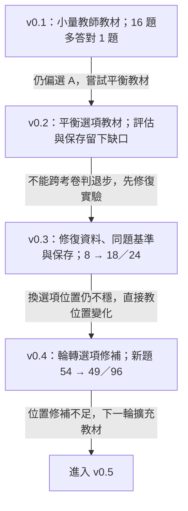
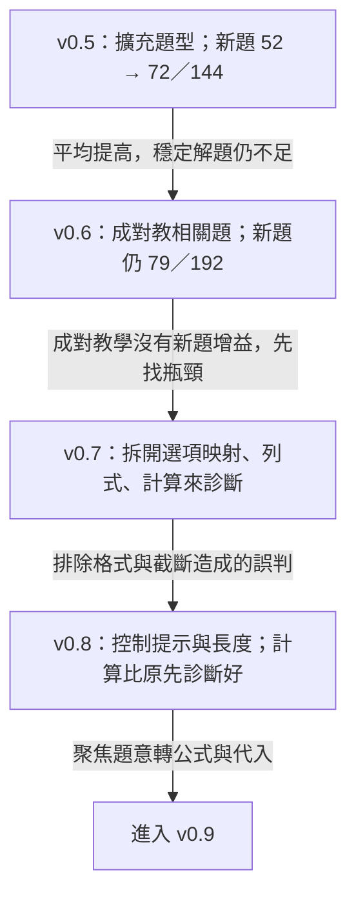
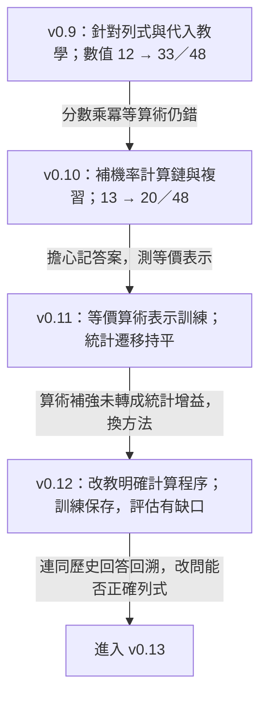
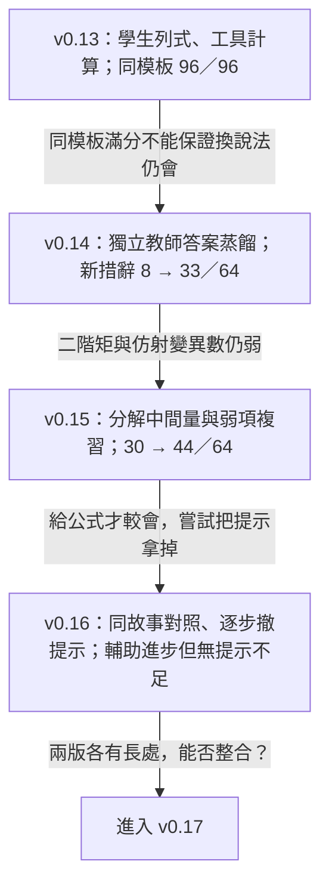
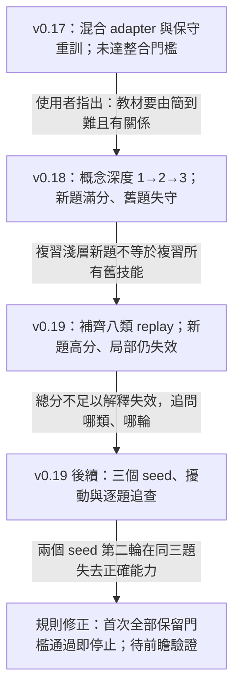

# 蒸餾實驗 v0.1–v0.19：問題、方法、結果與下一步

這份文件整理 3Beethoven **統計蒸餾支線**的十九個版本節點，保留我們為什麼繼續、改了什麼，以及結果如何改變下一個問題。版本號不是 Kaggle 保存版本號；v0.7、v0.8 是診斷實驗，並未訓練新權重。

**閱讀原則：**這是事後依原始報告、協議與使用者回顧整理的研究路徑。「預期」是對當時方法所欲解決問題的重述，不一律代表當時已事前註冊。流程箭頭表示研究動機的延續，**不表示每版權重都承接上一版**。各輪題目、提示與判分曾改變，下面的分數只在同一列所指的同場比較內解讀，不能串成十九版的準確率曲線。

## 1．v0.1–v0.4：先確認教得動，再確認分數可信

| 版本 | 遇到的狀況與預期 | 使用的方法 | 得到的結果與判斷 |
|---|---|---|---|
| **v0.1** | 70B 老師在選定的小型統計題集明顯優於 3B，想測試少量教師答案能否移轉能力。 | 120 筆教師教材，111／9 訓練與驗證，QLoRA 訓練 3 輪。 | 同一 16 題由 9/16 到 10/16；仍有選 A 偏差。這是小樣本的初步改善，不能證明穩定能力提升。[原始紀錄](../results/2026-09-02_stats_distillation_v0_1.md) |
| **v0.2** | 第一輪改善有限且有選項偏差；嘗試平衡選擇題教材。 | 採用平衡教材生成與訓練流程，改以 24 題開發集評估。 | 歷史報告分數 41.67%（10/24），但沒有同題原生 3B 基準，訓練／測試輸出格式也不同；後續未能驗證當時權重保存。**不能把 62.5% → 41.67% 寫成退步。**完整動機與成果保存紀錄有缺口。[後續核查](STATS_V0_3_PROTOCOL.md) |
| **v0.3** | v0.2 混有資料、格式、比較與保存問題，需先建立能核查的實驗。 | 60 題可計算參考答案，逐題審教師解說；48／12 分割；同場測原生學生、訓練學生與教師，補做新題及選項輪轉。 | 已曝光的 24 題，字母作答由 8/24 到 18/24。另組 60 題原序 35% → 58.3%，但四種排列全對只有 17/60。有效果的跡象與位置敏感同時存在。[結果](STATS_V0_3_RESULTS.md)、[新題](STATS_HOLDOUT_V1_RESULTS.md)、[輪轉](STATS_ROTATION_V1_RESULTS.md) |
| **v0.4** | v0.3 換選項位置會變，預期位置平衡訓練能改善穩定性。 | 重用同批教師教材與分割，加入選項輪轉修補。 | 同場新題 v0.3 54/96、v0.4 49/96；舊題 129/240 → 134/240。位置一致有些改善，卻未帶來新題總分提升；不取代 v0.3。[結果](STATS_V0_4_RESULTS.md) |

## 2．v0.5–v0.8：更多教材仍不夠，拆開看錯在哪裡

| 版本 | 遇到的狀況與預期 | 使用的方法 | 得到的結果與判斷 |
|---|---|---|---|
| **v0.5** | 只修選項位置不足；預期更廣的例題與情境有助遷移。 | 擴為 180 訓練題、24 驗證題；教師教材經獨立計算與內容稽核。 | 新題 v0.3 52/144 → v0.5 72/144，但四種排列全對僅 2/36。訓練跑三輪，驗證選第一輪；後兩輪驗證 loss 上升，早期已有過擬合跡象。保留為研究候選。[結果](STATS_V0_5_RESULTS.md) |
| **v0.6** | 題目彼此的關係可能沒教清楚，嘗試成對呈現相關問題。 | 原先抽象教學卡有錯而棄用；改將已稽核 v0.5 題目／解說配對。 | 同場新題 v0.5 與 v0.6 都是 79/192；舊題 133/240 → 140/240。未達預設成功門檻，保留 v0.5。配對同時改變文字量與重複曝光，不能當作只改「關係」的單因素實驗。[結果](STATS_V0_6_RESULTS.md) |
| **v0.7** | 分數不再改善，需分辨是看不懂題、算不出來，還是選不對選項。 | **只做診斷**：提供正確數值、公式、代入算式，並移除選項分別測試。 | v0.5 原 MC 為 41/96，提供正確數值後選項映射達 96/96；獨立求值差。證據指向多重瓶頸，但部分結果受提示、格式及輸出長度影響，須由下一輪校正。[結果](STATS_DIAGNOSTIC_V0_7_RESULTS.md) |
| **v0.8** | v0.7 的低分可能把輸出限制誤認成能力缺失。 | **只做診斷**：增加輸出空間，使用簡潔計算提示，另外複核格式。 | 給定算式時 v0.5 自動 18/24、格式複核 20/24；完整題目用簡潔提示仍只有 8/24。不能說小模型普遍不會計算；題意轉換與代入仍需加強。[結果](STATS_DIAGNOSTIC_V0_8_RESULTS.md) |

## 3．v0.9–v0.12：教計算之後，發現「列得對、算錯」

| 版本 | 遇到的狀況與預期 | 使用的方法 | 得到的結果與判斷 |
|---|---|---|---|
| **v0.9** | 診斷顯示題意轉公式、代入與計算鏈都需教。 | 從原生學生訓練，180 訓練／24 驗證，使用經稽核的簡潔教師解答。 | 同場新 MC：v0.5 91/192 → v0.9 123/192；複核數值 12/48 → 33/48。超過原生學生兩倍，但輪轉穩定性未達門檻；舊 MC 133/240 → 127/240。回溯列式與代入分為 45/48，顯示最終數值分漏掉部分能力。[結果](STATS_V0_9_RESULTS.md)、[回溯](STATS_FORMULATION_AUDIT.md) |
| **v0.10** | 機率分數運算仍錯，預期完整計算鏈加複習有助改善。 | 112 筆稽核教師紀錄，組成含複習的 516 訓練序列、64 驗證序列。 | 同場 v0.9 → v0.10：數值 13/48 → 20/48，MC 67/192 → 87/192；仍未達主要目標。回溯代入列式 42/48 → 45/48，算術與列式應分開看。[結果](STATS_V0_10_REPORT.md)、[回溯](STATS_FORMULATION_AUDIT.md) |
| **v0.11** | 使用者質疑熟悉小數可能只是記憶；預期等價表示練習能使算術更穩定。 | 400 筆程序化精確算術加 516 筆原教材複習；無新增教師呼叫，驗證選第一輪。 | 同場標準表示 43/60 → 39/60，等價表示 23/60 → 31/60；統計遷移 16/48 → 16/48。局部算術變好，沒有證明統計能力跟著改善。[結果](STATS_V0_11_REPORT.md) |
| **v0.12** | v0.11 的算術補強沒有帶來遷移，改試更明確的程序教學。 | 從 v0.10 重起；560 筆位值乘法、乘冪、GCD、約分及統計計算鏈，加 516 筆複習。 | 270 次更新完成，驗證選第 135 步，Kaggle 已保存；完整比較在瀏覽器存取中斷時尚未完成。**目前保留紀錄不足以判定 v0.12 提升或失敗。**後續改列式目標也依據 v0.9–v0.11 的原始回答，而非虛構 v0.12 結果。[保存紀錄](STATS_V0_12_INTERIM.md) |

## 4．v0.13–v0.16：把計算交給工具，再追查概念弱項

| 版本 | 遇到的狀況與預期 | 使用的方法 | 得到的結果與判斷 |
|---|---|---|---|
| **v0.13** | 歷史答案常有正確公式與代入，卻在算術失敗；改讓學生負責可執行列式。 | 從 v0.10 出發，384 訓練／64 驗證／96 測試；程序化 SFT，輸出數值綁定與算式，再由工具計算。 | 同模板族 96/96 列式成立；回溯原生與 v0.10 正確列式出現數為 18/96、39/96，部分伴隨矛盾。這些回溯分不等於合格工具介面分。後續換措辭測試暴露遷移弱點，滿分不能當未知概念泛化。[協議](STATS_V0_13_PROTOCOL.md)、[回答](STATS_V0_13_RESULTS.json)、[格式獨立複核](STATS_V0_13_FORMAT_INDEPENDENT_REVIEW.json) |
| **v0.14** | 程序模板學得好，不保證自然語言遷移；也需確認教師答案本身可靠。 | 接 v0.13，以 126 筆訓練／31 筆驗證的獨立且逐題驗證教師答案做回應蒸餾；改一行數值算式。 | 同場新措辭／參數 64 題：原生 8、v0.13 8、v0.14 33；舊 MC v0.13 128/240 → v0.14 123/240。老師也有錯，須驗證；學生有進展但並非全面保留。[結果](STATS_V0_14_TRAINING_RUN.md) |
| **v0.15** | 二階矩、仿射 Poisson 變異數等弱；預期教平均數、變異數等中間量可幫助組合。 | 接 v0.14，200 訓練／30 驗證；教師答案稽核、弱項加量、中間量分解與舊題複習，75 次更新。 | 同場 v0.14 30/64 → v0.15 44/64，**14 題錯轉對、0 題對轉錯**；但兩個目標弱項仍各 0/8。另做診斷，給通用公式可到 7/8 與 4/8。整體改善與目標未解同時成立。[完成紀錄](../README.md)、[診斷](STATS_V0_15_DIAGNOSTIC.md) |
| **v0.16** | v0.15 在提示下較會，預期同故事對照與撤提示能轉成自主列式。 | 48 個故事對照倍率、平均數、變異數、二階矩；完整公式 → 所求量提醒 → 無提示，混入複習，150 次更新。 | 同場無提示 v0.15 34/96 → v0.16 29/96；兩弱項有公式時 11/24 → 22/24。目標部分改善，但其他題型受損，未成通用替代版。**這是提示程度分階段，還不是概念深度 1→2→3。**[結果](STATS_V0_16_REPORT.md) |

## 5．v0.17–v0.19：整合、排序與保留，最後追到「多練一輪反而壞」

| 版本 | 遇到的狀況與預期 | 使用的方法 | 得到的結果與判斷 |
|---|---|---|---|
| **v0.17** | v0.15 與 v0.16 各有強弱，使用者提出重新訓練或「縫合」。 | 三種 adapter 更新混合比例；另從 v0.15 以較低學習率、256 筆歷史教師教材做均衡複習，驗證先選候選。 | 同場 v0.15 64/96、v0.16 57/96、最佳混合 65/96、重訓 64/96。混合多對 5 題也失去 4 題，沒有達成整合目標。這裡明確允許 `comb(n,r)`，不可和上一輪的絕對分數直接比較。[結果](STATS_V0_17_REPORT.md) |
| **v0.18** | 使用者看過 15、16、17 後提出：先一次概念轉換，再混入兩次、三次，保留早期題與 checkpoint。 | 把概念深度落實為分階段課程、複習與進階條件，設相同教材曝光量與更新量的打亂順序對照。新增答案為程序生成。 | 新組合 v0.15 76/96，分階段與打亂均 96/96；舊題 v0.15 64/96，兩組降為 36/96、44/96。**未證明排序優於打亂**；兩者都沒保住舊技能。原 replay 只涵蓋新課程淺層，未涵蓋歷史八類。[動機](STATS_MOTIVATION_EXPECTATIONS.md)、[結果複核](STATS_V0_18_TRANSFER_REVIEW.md) |
| **v0.19** | v0.18 新課程高分卻失去歷史技能；預期全面舊題複習及逐類保留門檻能改善。 | 從固定原 v0.15 出發，192 筆歷史教師複習＋288 筆程序化新題，共 480；逐輪驗證、逐題型保留門檻及 checkpoint 回退，無新增教師呼叫。 | 原 seed 1919 跑一輪／60 次更新：新題 72/96 → 96/96，舊題 59/96 → 56/96，exactly_one 10/12 → 1/12。未通過保留門檻，不升級。整體配對 p=0.7011，未偵測到總分差異；局部事件題失效須另看，不能用總分掩蓋。[結果](STATS_V0_19_REPORT.md)、[分析](STATS_V19_ANALYSIS_REPORT.md) |

## 6．v0.19 的後續追查：把失望變成可檢驗的規則修正

以下仍是 v0.19 的複驗與分析，**不是 v0.20，也沒有啟動另一輪新配方訓練**。

| 追問 | 做了什麼 | 確認到什麼 |
|---|---|---|
| 96/96 是不是只會模板？ | 固定權重測原敘述、改寫、數字量級，並在三個 seed 重做。 | 三個 v0.19 原敘述與量級題均 24/24，改寫僅 15、15、14/24。高分可重現，但語言遷移不穩；不能僅憑滿分證明記憶，也不能把它叫未知概念泛化。 |
| 差幾題會不會只是 seed 波動？ | v0.15、v0.19 各跑 1919、2027、31415，完成六次訓練及 3,120 筆共同評估。 | v0.15 舊題為 52、55、49/96；v0.19 為 56、56、48/96。三個新 v0.15 不是三個 v0.19 的父模型；v0.19 均從原固定 v0.15 出發。不能把組均值差當單一因素效果。 |
| exactly_one 三次是否同一種壞法？ | 逐題分類：漏事件分支、兩者都漏、把恰好一個寫成兩者相同，以及數字綁定錯誤。 | 固定父模型 10/12，三個 seed 為 1、7、4/12；共同事件弱點存在，但錯誤分布不同。另一組事件對照三次都失敗，原 v0.15 也已失敗，不能全歸因 v0.19。 |
| 第一輪通過，第二輪為什麼不過？ | 對照 seed 2027、31415 的兩輪原始答案、逐類驗證、教材與 loss。 | **兩個 seed 都在同三題仿射 Poisson 變異數由對變錯**；該驗證類別從 3/6 到 0/6。第二輪總分仍過總量門檻，但此類低於 1/6，因此被退回第一輪。 |
| 越練 loss 越低，能力卻下降？ | 比較相同紀錄方式的兩輪訓練 loss 與答案。 | 兩次訓練 loss 約 0.092 → 0.012；資料比例及學習率不變，部分保留能力卻消失。降低訓練 loss 不足以當繼續訓練的理由。尚無逐 batch／逐類 loss，不能鎖定是哪個梯度造成。 |

來源：[多 seed 最終報告與逐題分析](STATS_SEED_REPLICATION_REPORT.md)、[exactly_one 對照資料](STATS_SEED_EXACTLY_ONE_COMPARISON.json)、[兩輪對照資料](STATS_SEED_EPOCH_TRANSITION.json)。

### 最能讓人看懂的錯誤對照

下面是同一批三題的**第一輪正確式與第二輪實際回答**，不是示意數字。

| 第一輪：兩個 seed 都正確 | 第二輪：seed 2027 | 第二輪：seed 31415 |
|---|---|---|
| `7² × 62` | `7² × 62 ÷ 7` | `7² + 2` |
| `7² × 17` | `7² × 17 + 7 × 19 − 7² × 17` | `7² × 17 + 19` |
| `3² × 44` | `3² × 44 ÷ 3 + 3` | `3 + 3 × 44` |

題目要的是變異數。第一輪能保留倍率平方與 Poisson 參數的關係，第二輪卻多除倍率、混入平移量，或改用類似平均數的式子。**同三題失效是直接證據；每個 seed 的錯誤算式並不完全相同。**

這支持「此配方在第二輪出現局部保留失效」，但還不能證明失去的是「最晚學會的能力」，也不能用第二輪的 Poisson 變異數失效解釋第一輪已存在的 exactly_one 差異。

### 留給下一次實驗的具體規則

**下一次將「首次所有題型均通過預定保留門檻，即停止並保存」列為待驗證的停止規則，不再單純等兩輪停滯或四輪上限。**保留門檻通過不代表每題全對，也不自動代表模型可以升級；升級仍需獨立測試新能力、改寫遷移及舊能力保留。

同時固定一組永久基準、題目與 prompt／判分規則；各輪專項測試另報。歷史上已有 60 題四種排列的 MC 紀錄，但須核對載入及生成條件才能接成同一條線，240 次回答也不是 240 個獨立題目。三個 seed 提供初步變異估計，還不足以宣稱精確掌握所有波動。

這次能交出的研究產出是：**平均分數 → 局部錯誤 → 跨 seed 複驗 → 定位到第二輪 → 修正停止規則**。蒸餾在部分任務有增益，單一學生同時保有新舊能力仍未達標；目前保留原 v0.15，不升級 v0.19。規則已留下，效果須由未來實驗驗證。[Review 與交接](STATS_REVIEW_HANDOFF.md)
